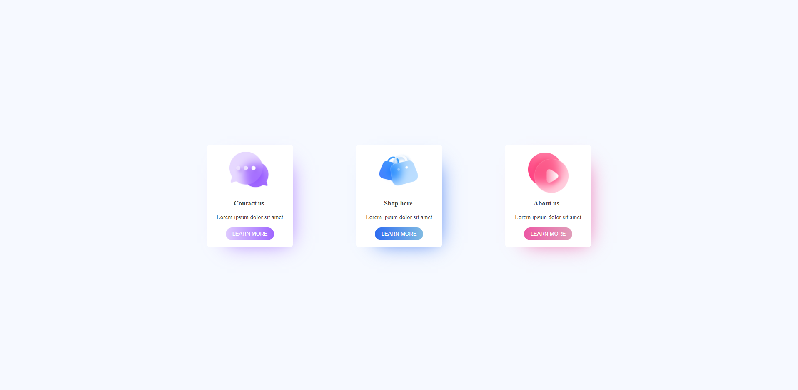
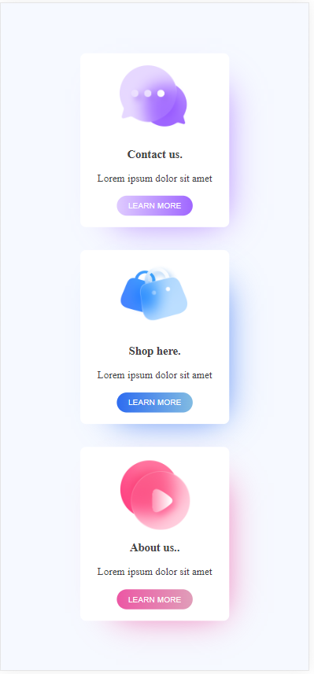

##  Responsive Cards  

  
  Desktop version.

   
  mobile version.

## 🚀 Tecnologias

The project was developed using the following technologies:

- HTML e CSS

## 💻 Projeto
Cards with learn more button to redirect to more informations. Available to be responsive and adapt to desktop and mobile version.

This project was made using Youtube tutorial!
Credits: @GiovannaMoeller